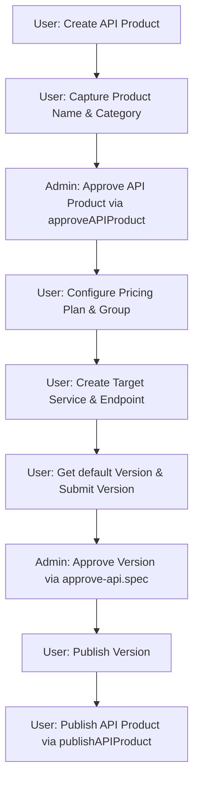

# Playwright API Testing Framework

A clean, modern, and highly scalable API automation testing framework built using Playwright Test. This project is fully headless, meaning it communicates directly with target servers via HTTP requests. It operates without downloading or launching heavy web browsers, keeping the framework fast and lightweight.

---

## 1. Project Directory Structure

Here is how the project files are organized:

```text
playwright-api/
│
├── auth/
│   ├── baseApiClient.js       # Shared API client logic for HTTP verbs
│   ├── baseRefreshToken.js    # Shared logic to request token refreshes
│   ├── baseTokenManager.js    # Shared logic to manage and validate token cache
│   │
│   ├── user/
│   │   ├── index.js           # Main entry point for User authentication
│   │   ├── apiClient.js       # Configured API client for User endpoints
│   │   ├── refreshToken.js    # Specific token refresh actions for Users
│   │   └── tokenManager.js    # Specific token storage configurations for Users
│   │
│   └── admin/
│       ├── index.js           # Main entry point for Admin authentication
│       ├── apiClient.js       # Configured API client for Admin endpoints
│       ├── refreshToken.js    # Specific token refresh actions for Admins
│       └── tokenManager.js    # Specific token storage configurations for Admins
│
├── config/
│   └── env.js                 # Environment variable reader and exporter
│
├── storage/
│   ├── user-token.json        # Saved User authentication credentials
│   ├── admin-token.json       # Saved Admin authentication credentials
│   └── token.json             # Legacy compatibility file for old test suites
│
├── tests/
│   ├── Users/
│   │   ├── API-Products/
│   │   │   ├── Paid-API-product/
│   │   │   │   ├── Paid_API_Product_Endpoint_Pricing_No_Tier.spec.js # E2E flat endpoint pricing workflow
│   │   │   │   ├── Published_Paid_API_Product_Endpoint_Pricing_No_Tier.spec.js # E2E flat endpoint pricing workflow + Publish
│   │   │   │   ├── Paid_API_Product_Endpoint_Pricing_Tier.spec.js    # E2E tier endpoint pricing workflow
│   │   │   │   ├── Published_Paid_API_Product_Endpoint_Pricing_Tier.spec.js    # E2E tier endpoint pricing workflow + Publish
│   │   │   │   ├── Paid_API_Product_Request_Based_Plan.spec.js       # E2E request-based pricing workflow
│   │   │   │   ├── Published_Paid_API_Product_Request_Based_Plan.spec.js       # E2E request-based pricing workflow + Publish
│   │   │   │   ├── Paid_API_Product_with_plan-as-package.spec.js     # E2E package pricing workflow
│   │   │   │   └── Published_Paid_API_Product_Plan_As_A_Package.spec.js # E2E package pricing workflow + Publish
│   │   │   │
│   │   │   ├── Paid BYOK Product/
│   │   │   │   ├── Paid-BYOK-Product-endpoint-pricing-no-tier.spec.js # E2E flat endpoint pricing BYOK workflow
│   │   │   │   ├── Published_Paid_BYOK_Product_Endpoint_Pricing_No_Tier.spec.js # E2E flat endpoint pricing BYOK workflow + Publish
│   │   │   │   ├── Paid-BYOK-Product-endpoint-pricing-tier.spec.js    # E2E tier endpoint pricing BYOK workflow
│   │   │   │   ├── Published_Paid_BYOK_Product_Endpoint_Pricing_Tier.spec.js    # E2E tier endpoint pricing BYOK workflow + Publish
│   │   │   │   ├── Paid-BYOK-Product-plan-as-a-package.spec.js        # E2E package pricing BYOK workflow
│   │   │   │   ├── Published_Paid_BYOK_Product_Plan_As_A_Package.spec.js        # E2E package pricing BYOK workflow + Publish
│   │   │   │   ├── Paid-BYOK-Product-plan-base-on-No.-of-request.spec.js # E2E request-based BYOK workflow
│   │   │   │   └── Published_Paid_BYOK_Product_Plan_Based_On_Number_Of_Requests.spec.js # E2E request-based BYOK workflow + Publish
│   │   │   │
│   │   │   ├── Free-API-product/
│   │   │   │   ├── Free_API_Product.spec.js                           # E2E Free API product workflow
│   │   │   │   └── Published_Free_API_Product.spec.js                 # E2E Free API product workflow + Publish
│   │   │   │
│   │   │   └── Free BYOK Product/
│   │   │       ├── Free_BYOK_Product.spec.js                          # E2E Free BYOK Product workflow
│   │   │       └── Published_Free_BYOK_Product.spec.js                # E2E Free BYOK Product workflow + Publish
│   │   │
│   │   ├── Published_module/
│   │   │   └── Published_the_API_Product.spec.js                  # Reusable Publish API Product module
│   │   │
│   │   └── pricing-plan/
│   │       ├── endpoint-pricing-no-tier.js   # Helper to configure flat endpoint pricing
│   │       ├── endpoint-pricing-tier.js      # Helper to configure tier-based endpoint pricing
│   │       ├── plan-as-a-package.js          # Helper to create package pricing plans
│   │       └── plan-base-on-No.-of-request.js # Helper to create request-based pricing plans
│   │
│   └── admin/
│       ├── Approve_API_Product/
│       │   └── approveAPIProduct.js          # Reusable Admin API Product Approval module
│       │
│       ├── approve-api/
│       │   └── approve-api.spec.js           # Admin API version approval test suite
│       │
│       └── services-api/
│           └── adminVersionService.spec.js   # Admin version service validation tests
│
├── utils/
│   ├── apiClient.js           # Legacy wrapper pointing to User client
│   ├── global-setup.js        # Script running once before all tests
│   └── tokenManager.js        # Legacy wrapper pointing to User manager
│
├── .env                       # Local secret configurations and refresh seeds
├── playwright.config.js       # Playwright global runner configuration
└── README.md                  # Detailed documentation and guidelines
```

---

## 2. Setup and Environment Configuration

To run these tests locally, you need to configure your local environment variables.

1. **Copy the template file**:
   ```bash
   cp .env.example .env
   ```
2. **Configure your credentials**:
   Open the newly created `.env` file and fill in the authorization tokens and base URL:
   - `BASE_URL`: The target API host (e.g. `https://apis-dev.api360.sa/portaldev/api`).
   - `USER_AUTHORIZATION_TOKEN`: Active Bearer Token for standard user authorization.
   - `ADMIN_AUTHORIZATION_TOKEN`: Active Bearer Token for admin/operations authorization.

> [!IMPORTANT]
> The `.env` file contains sensitive credentials and is explicitly ignored in `.gitignore`. Never commit `.env` or any other files containing tokens directly to the repository.

---

## 3. File Responsibilities & Purposes

### The Authentication Core (`auth/`)
* **`baseApiClient.js`**: Shared blueprint class defining standard HTTP methods (GET, POST, PUT, DELETE, PATCH). It handles the setup of headers and ensures that request connections are cleanly disposed of.
* **`baseRefreshToken.js`**: Shared utility function that sends refresh tokens to exchange them for fresh access tokens.
* **`baseTokenManager.js`**: Master brain class that checks stored tokens, decodes JWTs, and handles automatic refreshing and token storage.

### Identity Modules (`auth/user/` and `auth/admin/`)
* **`refreshToken.js` / `tokenManager.js` / `apiClient.js` / `index.js`**: Instantiates specific client and manager flows for User and Admin credentials respectively, maintaining credentials separation.

### Testing Suites & Helper Modules (`tests/`)
* **`tests/admin/Approve_API_Product/approveAPIProduct.js`**: The Admin API Product Approval module. It dynamically fetches pending count, identifies the project category/ID from the projects list, resolves the `'Test_Service_Azy_001'` service provider ID, and approves the API product (status `"accepted"`).
* **`tests/Users/Published_module/Published_the_API_Product.spec.js`**: Reusable module to publish an API Product. It queries project details via GET and submits a PATCH request to set `"published": true`.
* **`tests/Users/pricing-plan/`**: Reusable modules to configure pricing plans (Package Plan, Request-Based Plan, and Endpoint Pricing with/without tiers) in product creation test runs.
* **`tests/Users/API-Products/`**: Houses E2E specs for creating both Free and Paid products (BYOK and standard API formats) using the pricing plan helpers, as well as the 10 corresponding `Published_...` specs that automate the full creation sequence followed by final product publication.

---

## 4. Core Operational Logics & Workflows

### The Global Setup Sequence
Before executing tests, Playwright runs the setup hook (`utils/global-setup.js`):
1. **Initialize Environment**: Loads parameters from `.env`.
2. **Refresh User & Admin Tokens**: Validates current tokens. If expired, it exchanges seeds for active bearer tokens and updates file cache.
3. **Parity Healing**: Automatically heals any overwritten User storage configurations to prevent active sessions from collapsing during mock test execution.

---

## 5. End-to-End Workflow Scenario: Create, Approve & Publish API Product

The framework demonstrates dynamic, cross-role API workflows (creating as User, approving as Admin, and publishing as User):



1. **Create Product (User)**: Fetches lookups, generates an URL-compliant prefix, and sends a `POST /portaldev/api/projects` request.
2. **Admin-Side Product Approval (Admin)**: Calls the reusable `approveAPIProduct` module:
   - Gets pending count via `GET /admin/requests/pending/count`.
   - Filters `GET /admin/projects?page=1` by name/category and sorts by date to select the latest matching project ID.
   - Looks up `Test_Service_Azy_001` from `GET /admin/service-providers?per_page=100` and extracts its ID.
   - Sends a `PUT /admin/projects/{project-id}` with status `"accepted"` to accept the API product.
3. **Configure Plan & Backend (User)**: Adds the pricing configuration (package, request-based, or endpoint pricing) and maps the target services and `/users` endpoints.
4. **Submit Version (User)**: Submits the version to transition status to `pending_review`.
5. **Approve Version (Admin)**: Invokes the admin version review test suite to approve the submitted API version.
6. **Publish Version (User)**: Sends a `POST /versions/{id}/publish` request to mark the API product version active and live.
7. **Publish API Product (User)**: Calls the reusable `publishAPIProduct` module to send a `PATCH /portaldev/api/projects/{projectId}` setting `published: true`, rendering the API Product published and active.

---

## 6. Running and Debugging Tests

Ensure your `.env` contains correct credentials, then execute the following standard scripts:

```bash
# Run all tests sequentially
npx playwright test

# Run a specific E2E product creation workflow (which automatically triggers the admin approval module)
npx playwright test "tests/Users/API-Products/Paid BYOK Product/Paid-BYOK-Product-endpoint-pricing-no-tier.spec.js"

# Generate and view test execution reports
npx playwright show-report
```
