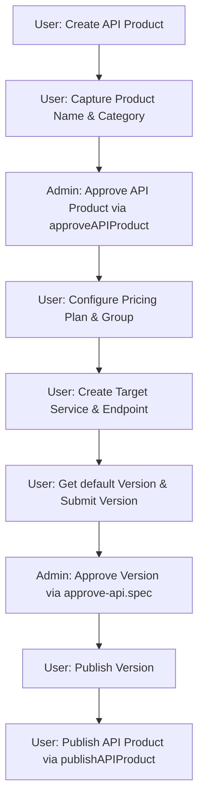

# Playwright API Testing Framework

A clean, modern, and highly scalable API automation testing framework built using Playwright Test. This project is fully headless, meaning it communicates directly with target servers via HTTP requests. It operates without downloading or launching heavy web browsers, keeping the framework fast and lightweight.

---

## 1. Project Directory Structure

Here is how the project files are organized:

```text
playwright-api/
│
├── auth/
│   ├── baseApiClient.js       # Shared API client logic for HTTP verbs
│   ├── baseRefreshToken.js    # Shared logic to request token refreshes
│   ├── baseTokenManager.js    # Shared logic to manage and validate token cache
│   │
│   ├── user/
│   │   ├── index.js           # Main entry point for User authentication
│   │   ├── apiClient.js       # Configured API client for User endpoints
│   │   ├── refreshToken.js    # Specific token refresh actions for Users
│   │   └── tokenManager.js    # Specific token storage configurations for Users
│   │
│   └── admin/
│       ├── index.js           # Main entry point for Admin authentication
│       ├── apiClient.js       # Configured API client for Admin endpoints
│       ├── refreshToken.js    # Specific token refresh actions for Admins
│       └── tokenManager.js    # Specific token storage configurations for Admins
│
├── config/
│   └── env.js                 # Environment variable reader and exporter
│
├── storage/
│   ├── user-token.json        # Saved User authentication credentials
│   ├── admin-token.json       # Saved Admin authentication credentials
│   └── token.json             # Legacy compatibility file for old test suites
│
├── tests/
│   ├── Users/
│   │   ├── Bank/
│   │   │   └── Connect_bank.spec.js           # Reusable bank account connection flow and validations
│   │   │
│   │   ├── KYC/
│   │   │   └── Add_kyc.spec.js                # E2E KYC/KYB submission (idempotent check) and Admin Approval flow
│   │   │
│   │   ├── Platform Subscription/
│   │   │   └── Platform-Subscription-of-user.spec.js # E2E Platform Subscription flow and Moyasar 3DS payment integration
│   │   │
│   │   ├── Delete API Product/
│   │   │   └── deleteApiProducts.spec.js      # Cleanup task to delete all API Products/projects
│   │   │
│   │   ├── API-Products/
│   │   │   ├── Paid-API-product/
│   │   │   │   ├── Paid_API_Product_Endpoint_Pricing_No_Tier.spec.js # E2E flat endpoint pricing workflow
│   │   │   │   ├── Published_Paid_API_Product_Endpoint_Pricing_No_Tier.spec.js # E2E flat endpoint pricing workflow + Publish
│   │   │   │   ├── Paid_API_Product_Endpoint_Pricing_Tier.spec.js    # E2E tier endpoint pricing workflow
│   │   │   │   ├── Published_Paid_API_Product_Endpoint_Pricing_Tier.spec.js    # E2E tier endpoint pricing workflow + Publish
│   │   │   │   ├── Paid_API_Product_Request_Based_Plan.spec.js       # E2E request-based pricing workflow
│   │   │   │   ├── Published_Paid_API_Product_Request_Based_Plan.spec.js       # E2E request-based pricing workflow + Publish
│   │   │   │   ├── Paid_API_Product_with_plan-as-package.spec.js     # E2E package pricing workflow
│   │   │   │   └── Published_Paid_API_Product_Plan_As_A_Package.spec.js # E2E package pricing workflow + Publish
│   │   │   │
│   │   │   ├── Paid BYOK Product/
│   │   │   │   ├── Paid-BYOK-Product-endpoint-pricing-no-tier.spec.js # E2E flat endpoint pricing BYOK workflow
│   │   │   │   ├── Published_Paid_BYOK_Product_Endpoint_Pricing_No_Tier.spec.js # E2E flat endpoint pricing BYOK workflow + Publish
│   │   │   │   ├── Paid-BYOK-Product-endpoint-pricing-tier.spec.js    # E2E tier endpoint pricing BYOK workflow
│   │   │   │   ├── Published_Paid_BYOK_Product_Endpoint_Pricing_Tier.spec.js    # E2E tier endpoint pricing BYOK workflow + Publish
│   │   │   │   ├── Paid-BYOK-Product-plan-as-a-package.spec.js        # E2E package pricing BYOK workflow
│   │   │   │   ├── Published_Paid_BYOK_Product_Plan_As_A_Package.spec.js        # E2E package pricing BYOK workflow + Publish
│   │   │   │   ├── Paid-BYOK-Product-plan-base-on-No.-of-request.spec.js # E2E request-based BYOK workflow
│   │   │   │   └── Published_Paid_BYOK_Product_Plan_Based_On_Number_Of_Requests.spec.js # E2E request-based BYOK workflow + Publish
│   │   │   │
│   │   │   ├── Free-API-product/
│   │   │   │   ├── Free_API_Product.spec.js                           # E2E Free API product workflow
│   │   │   │   └── Published_Free_API_Product.spec.js                 # E2E Free API product workflow + Publish
│   │   │   │
│   │   │   └── Free BYOK Product/
│   │   │       ├── Free_BYOK_Product.spec.js                          # E2E Free BYOK Product workflow
│   │   │       └── Published_Free_BYOK_Product.spec.js                # E2E Free BYOK Product workflow + Publish
│   │   │
│   │   ├── Published_module/
│   │   │   └── Published_the_API_Product.spec.js                  # Reusable Publish API Product module
│   │   │
│   │   └── pricing-plan/
│   │       ├── endpoint-pricing-no-tier.js   # Helper to configure flat endpoint pricing
│   │       ├── endpoint-pricing-tier.js      # Helper to configure tier-based endpoint pricing
│   │       ├── plan-as-a-package.js          # Helper to create package pricing plans
│   │       └── plan-base-on-No.-of-request.js # Helper to create request-based pricing plans
│   │
│   └── admin/
│       ├── Approve_API_Product/
│       │   └── approveAPIProduct.js          # Reusable Admin API Product Approval module
│       │
│       ├── approve-api/
│       │   └── approve-api.spec.js           # Admin API version approval test suite
│       │
│       └── services-api/
│           └── adminVersionService.spec.js   # Admin version service validation tests
│
├── utils/
│   ├── apiClient.js           # Legacy wrapper pointing to User client
│   ├── global-setup.js        # Script running once before all tests
│   └── tokenManager.js        # Legacy wrapper pointing to User manager
│
├── .env                       # Local secret configurations and refresh seeds
├── playwright.config.js       # Playwright global runner configuration
└── README.md                  # Detailed documentation and guidelines
```

---

## 2. Setup and Environment Configuration

To run these tests locally, you need to configure your local environment variables.

1. **Copy the template file**:
   ```bash
   cp .env.example .env
   ```
2. **Configure your credentials**:
   Open the newly created `.env` file and fill in the authorization tokens and base URL:
   - `BASE_URL`: The target API host (e.g. `https://apis-dev.api360.sa/portaldev/api`).
   - `USER_AUTHORIZATION_TOKEN`: Active Bearer Token for standard user authorization.
   - `ADMIN_AUTHORIZATION_TOKEN`: Active Bearer Token for admin/operations authorization.

> [!IMPORTANT]
> The `.env` file contains sensitive credentials and is explicitly ignored in `.gitignore`. Never commit `.env` or any other files containing tokens directly to the repository.

---

## 3. File Responsibilities & Purposes

### The Authentication Core (`auth/`)
* **`baseApiClient.js`**: Shared blueprint class defining standard HTTP methods (GET, POST, PUT, DELETE, PATCH). It automatically handles the setup of headers, disposes of request connections cleanly, and dynamically refreshes expired/invalid Bearer tokens on the fly for self-healing execution.
* **`baseRefreshToken.js`**: Shared utility function that sends refresh tokens to exchange them for fresh access tokens.
* **`baseTokenManager.js`**: Master brain class that checks stored tokens, decodes JWTs, and handles automatic refreshing and token storage.

### Identity Modules (`auth/user/` and `auth/admin/`)
* **`refreshToken.js` / `tokenManager.js` / `apiClient.js` / `index.js`**: Instantiates specific client and manager flows for User and Admin credentials respectively, maintaining credentials separation.

### Testing Suites & Helper Modules (`tests/`)
* **`tests/admin/Approve_API_Product/approveAPIProduct.js`**: The Admin API Product Approval module. It dynamically fetches pending count, identifies the project category/ID from the projects list, resolves the `'Test_Service_Azy_001'` service provider ID, and approves the API product (status `"accepted"`).
* **`tests/Users/Published_module/Published_the_API_Product.spec.js`**: Reusable module to publish an API Product. It queries project details via GET and submits a PATCH request to set `"published": true`.
* **`tests/Users/pricing-plan/`**: Reusable modules to configure pricing plans (Package Plan, Request-Based Plan, and Endpoint Pricing with/without tiers) in product creation test runs.
* **`tests/Users/Delete API Product/deleteApiProducts.spec.js`**: Cleanup task that deletes all API Products/projects from the system. It retrieves all paginated projects, deduplicates project IDs, sends DELETE requests with a reason payload, and skips individual errors.
* **`tests/Users/Bank/Connect_bank.spec.js`**: Reusable bank account connection flow. It checks if the bank account is already connected, and connects it if not, verifying that duplicate entries are avoided.
* **`tests/Users/KYC/Add_kyc.spec.js`**: E2E KYC submission and approval flow. It queries the consumer KYC details status, skipping the workflow if it is already present and approved, or submitting and approving the KYC request via the Admin API if it is not present.
* **`tests/Users/Platform Subscription/Platform-Subscription-of-user.spec.js`**: E2E Platform Subscription flow. Automatically displays plans/tiers, subscribes a user to a selected plan/tier (with console prompts or environment overrides), generates sandbox payment tokens via Moyasar API, programmatically handles redirection & simulated 3DS sandbox card validation over HTTP, and confirms the subscription status is active.
* **`tests/Users/API-Products/`**: Houses E2E specs for creating both Free and Paid products (BYOK and standard API formats) using the pricing plan helpers, as well as the 10 corresponding `Published_...` specs that automate the full creation sequence followed by final product publication.

---

## 4. Core Operational Logics & Workflows

### The Global Setup Sequence
Before executing tests, Playwright runs the setup hook (`utils/global-setup.js`):
1. **Initialize Environment**: Loads parameters from `.env`.
2. **Refresh User & Admin Tokens**: Validates current tokens. If expired, it exchanges seeds for active bearer tokens and updates file cache.
3. **Parity Healing**: Automatically heals any overwritten User storage configurations to prevent active sessions from collapsing during mock test execution.

### Dynamic On-Demand Token Refreshing
In addition to the Global Setup sequence, the API Client (`auth/baseApiClient.js`) performs a just-in-time check right before initiating any request context. If it detects that the stored User/Admin token is expired or invalid (using the JSON Web Token's `exp` claim check), it dynamically triggers a token refresh behind the scenes. This ensures that:
- Tests do not fail with `401 Unauthorized` if the environment-level variable `SKIP_GLOBAL_SETUP` is set to `true`.
- Individual test suites remain self-healing and robust, regardless of when they are executed or how setup parameters are set.

---

## 5. End-to-End Workflow Scenario: Create, Approve & Publish API Product

The framework demonstrates dynamic, cross-role API workflows (creating as User, approving as Admin, and publishing as User):



1. **Create Product (User)**: Fetches lookups, generates an URL-compliant prefix, and sends a `POST /portaldev/api/projects` request.
2. **Admin-Side Product Approval (Admin)**: Calls the reusable `approveAPIProduct` module:
   - Gets pending count via `GET /admin/requests/pending/count`.
   - Filters `GET /admin/projects?page=1` by name/category and sorts by date to select the latest matching project ID.
   - Looks up `Test_Service_Azy_001` from `GET /admin/service-providers?per_page=100` and extracts its ID.
   - Sends a `PUT /admin/projects/{project-id}` with status `"accepted"` to accept the API product.
3. **Configure Plan & Backend (User)**: Adds the pricing configuration (package, request-based, or endpoint pricing) and maps the target services and `/users` endpoints.
4. **Submit Version (User)**: Submits the version to transition status to `pending_review`.
5. **Approve Version (Admin)**: Invokes the admin version review test suite to approve the submitted API version.
6. **Publish Version (User)**: Sends a `POST /versions/{id}/publish` request to mark the API product version active and live.
7. **Publish API Product (User)**: Calls the reusable `publishAPIProduct` module to send a `PATCH /portaldev/api/projects/{projectId}` setting `published: true`, rendering the API Product published and active.

---

## 6. Running and Debugging Tests

The framework supports both **DEV** and **STAGING** environments with complete isolation of environment configurations, URL resolution, and authentication token storage.

### Supported Environments

| Environment | Base URL | Config File | Token Cache Directory |
| :--- | :--- | :--- | :--- |
| **DEV** | `https://apis-dev.api360.sa/portaldev/api` | `.env` | `storage/` |
| **STAGING** | `https://apis-stg.api360.sa/portalstg/api/` | `.env.stg` | `storage/staging/` |

### Environment Configuration

Configure credentials using separate environment files. Copies of these configurations are ignored by Git for security.

1. **DEV Configuration (`.env`)**:
   Ensure `.env` contains:
   ```env
   BASE_URL=https://apis-dev.api360.sa/portaldev/api
   USER_AUTHORIZATION_TOKEN=<DEV_USER_REFRESH_TOKEN>
   ADMIN_AUTHORIZATION_TOKEN=<DEV_ADMIN_REFRESH_TOKEN>
   ```

2. **STAGING Configuration (`.env.stg`)**:
   Ensure `.env.stg` contains:
   ```env
   BASE_URL=https://apis-stg.api360.sa/portalstg/api/
   USER_AUTHORIZATION_TOKEN=<STAGING_USER_REFRESH_TOKEN>
   ADMIN_AUTHORIZATION_TOKEN=<STAGING_ADMIN_REFRESH_TOKEN>
   ```

### Running Tests

Run tests using the cross-platform environment test runner:

```bash
# Run DEV tests sequentially
npm run test:dev

# Run STAGING tests sequentially
npm run test:stg

# Run a specific spec on DEV (forward extra Playwright arguments)
npm run test:dev -- tests/Users/API-Products/Free-API-product/Free_API_Product.spec.js

# Run a specific spec on STAGING (forward extra Playwright arguments)
npm run test:stg -- tests/Users/API-Products/Free-API-product/Free_API_Product.spec.js

# Run tests in Playwright debug mode
npm run test:dev -- --debug
npm run test:stg -- --debug

# View reports
npm run test:report
```

### Token Storage & Isolation

Authentication tokens for each environment are stored in separate directories. Running tests in one environment will never read, write, or overwrite the credentials of the other environment:
- **DEV User Token**: `storage/user-token.json`
- **DEV Admin Token**: `storage/admin-token.json`
- **STAGING User Token**: `storage/staging/user-token.json`
- **STAGING Admin Token**: `storage/staging/admin-token.json`

The global setup script automatically detects the active environment via `ENV=dev` or `ENV=stg`, loads the correct configuration file, and isolates token storage locations. Furthermore, API Client requests automatically route `/portaldev/api` endpoints to `/portalstg/api` when running in the STAGING environment via a dynamic Proxy rewriter, allowing the same test suites to execute against either environment unchanged.

---

## 7. Additional User Workflows

### Bank Account Connection Flow
This flow verifies the capability to link bank accounts to the platform while ensuring idempotency:
1. **Query Existing Accounts**: Triggers a `GET /api/bank-accounts` to retrieve all currently connected bank accounts.
2. **Prevent Duplicates**: Checks if the target account number (e.g. `SA0380000000608010167519`) already exists in the system.
3. **Establish Connection**: If not found, makes a `POST /api/bank-accounts` with holder name, bank name, and account details to set up the default account.

### Platform Subscription Flow
This flow automates subscribing a user to a platform billing plan using Moyasar API and programmatically handling 3DS security:
1. **Fetch & Print Plans**: Pulls available plans via `GET /api/consumer/platform-subscriptions`, printing names, pricing, and tiers.
2. **Plan/Tier Selection**: Resolves the target subscription plan and tier dynamically (using console inputs or `SELECTED_PLAN_NAME` and `SELECTED_TIER_NAME` environment variables).
3. **Subscribe**: Submits a `POST /api/consumer/platform-subscriptions/subscribe` to generate an order number.
4. **Moyasar Token Generation**: Generates a test credit card token via `POST https://api.moyasar.com/v1/tokens`.
5. **Initiate Payment**: Triggers `POST /api/consumer/platform-subscriptions/payment/initiate` using the generated token and order number.
6. **3DS Programmatic Authentication Redirection**:
   - Parses the transaction redirect URL to retrieve the `card_auth` ID.
   - Submits simulated device details to `https://api.moyasar.com/v1/card_auth/{id}/authenticate`.
   - Approves the transaction sandbox status by setting `auth_result` to `AUTHENTICATED` via `/set_auth_result`.
   - Completes session on `/acs_return` to retrieve the payment ID callback URL.
7. **Payment Confirmation**: Calls `POST /api/consumer/platform-subscriptions/payment/confirm` using the verified payment ID.
8. **Verify Activation**: Calls `/api/consumer/platform-subscriptions/me` to assert that the status is now `"active"`.

### KYC Submission & Approval Flow
This workflow automates the consumer KYC/KYB submission and administrative approval:
1. **Check Existing Status**: Queries `GET /portaldev/api/consumer/kyc-kyb/kyc-details`. If KYC details are already present and approved by Admin, the test logs a message and exits early to ensure idempotency.
2. **Submit KYC**: If not present, makes a `POST /portaldev/api/consumer/kyc-kyb/kyc` with user details (username, email, national ID, mobile, etc.).
3. **Admin Approval**: Fetches the KYC request list via the Admin GET endpoint, matches it by ID or email, extracts the `profile_id`, and sends a `PATCH` request to `/api/admin/kyc-kyb/{kycId}/profile/{profileId}` to transition status to `COMPLETED`.
